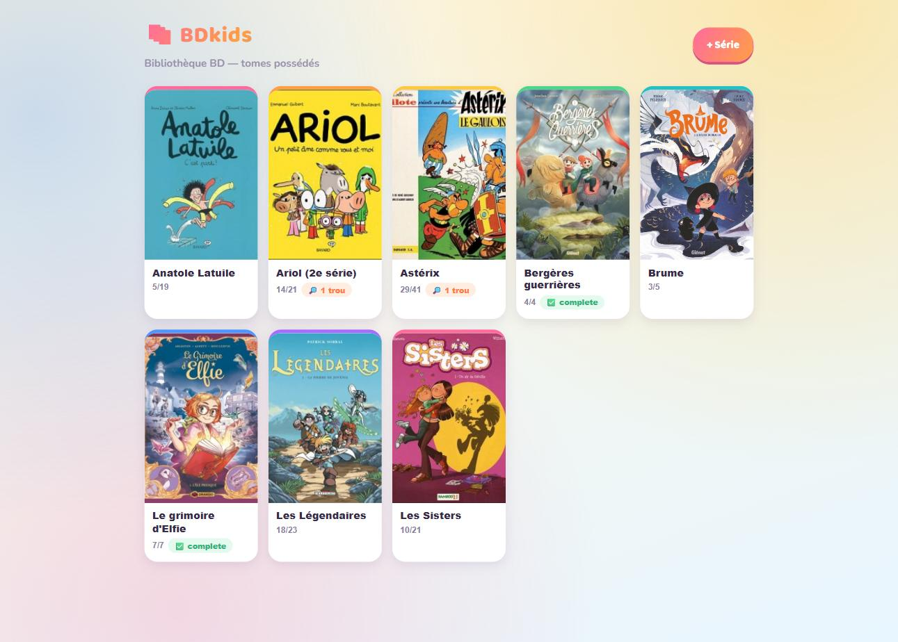
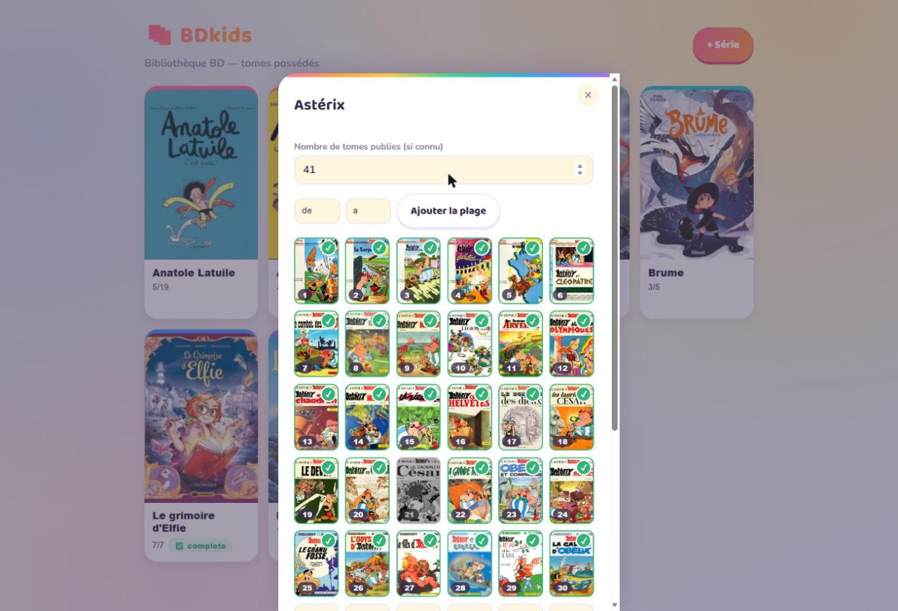
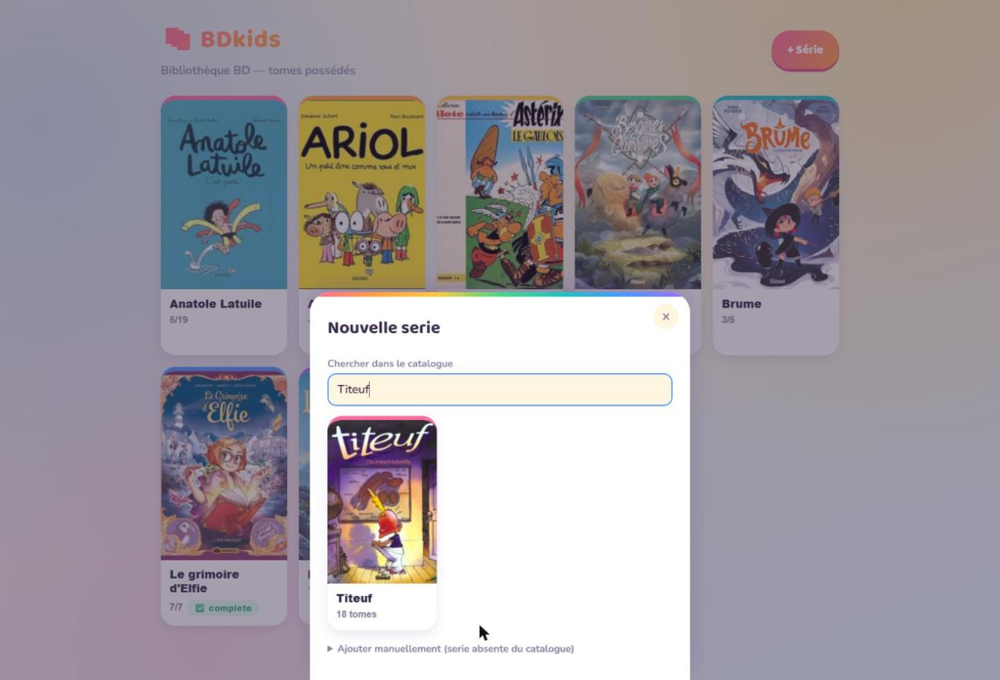

# BDkids 📚

**« On l'a déjà, ce tome, ou pas ? »** — la question classique au rayon BD jeunesse d'une
librairie, avec un enfant qui tire la manche. BDkids y répond en deux secondes : la bibliothèque
BD de tes enfants dans ta poche, tome par tome, série par série.

**En ligne, gratuit, sans compte : https://nkoziel.github.io/bdkids-app/**

## Ce que ça t'apporte

- 🔍 **85 séries BD jeunesse déjà prêtes** (Astérix, Tintin, Lucky Luke, Ariol, Les Sisters,
  Mortelle Adèle, Les Légendaires...) — cherche une série, ajoute-la en un clic : couverture,
  éditeur et liste des tomes se remplissent tout seuls
- 🖼️ **La vraie couverture de chaque tome**, pas juste un numéro — grisée si pas encore
  possédée, cochée en vert sinon : les trous de la collection sautent aux yeux
- ✅ **Coche les tomes possédés du bout du doigt**, ou ajoute une plage entière d'un coup
  (« j'ai les tomes 1 à 12 »)
- 🕳️ **Badge des trous** directement affiché sur la bibliothèque, pour vérifier vite en rayon
- ✏️ **Ajout manuel** pour toute série qui manquerait au catalogue
- 📴 **Marche hors-ligne** une fois installée — utile en librairie sans réseau
- 🔒 **Rien ne quitte ton téléphone** : pas de compte, pas de serveur, tout reste sur l'appareil

## Aperçu

**La fiche d'une série** — la vraie couverture de chaque tome, grisée pour les tomes manquants :

**Ajouter une série** — recherche dans le catalogue local, résultat pré-rempli en un clic :

## Installer sur le téléphone

Ouvre https://nkoziel.github.io/bdkids-app/ dans Chrome (Android) ou Safari (iOS), puis
« Ajouter à l'écran d'accueil ». L'appli s'installe comme une vraie appli et fonctionne ensuite
hors-ligne.
